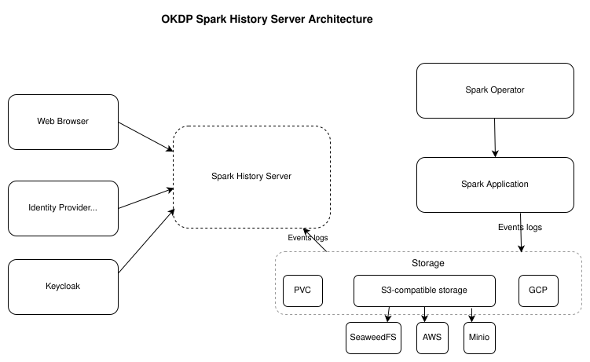

<p align="center">
  <a href="https://okdp.io">
    
  </a>
</p>

[](https://github.com/OKDP/okdp-superset/actions/workflows/ci.yml)
[](https://github.com/OKDP/okdp-superset/actions/workflows/release-please.yml)
[](https://github.com/OKDP/spark-history-server/releases/latest)
[](http://www.apache.org/licenses/LICENSE-2.0)

# OKDP Spark History Server

OKDP Spark History Server is a packaging of [Apache Spark History Server](https://spark.apache.org/) for Kubernetes: a Helm chart that wraps the official Apache Spark History Server chart with OAuth2/OIDC providers (Keycloak, Dex), optional OAuth2 for Trino, and externalized Kubernetes Secrets.

A Helm chart for the [Spark History Server](https://spark.apache.org/docs/latest/monitoring.html#viewing-after-the-fact).

## Why this project

The upstream OKDP Spark Helm chart deploys Spark History Server, but several integrations have to be implemented from scratch on every install:

- **OAuth2/OIDC requires custom Python code.** Wiring Keycloak or Dex means writing a `CustomSsoSecurityManager` and injecting it via `configOverrides`.
- **The official Docker image does not bundle Trino, PostgreSQL drivers or `Authlib`.** They have to be installed at deploy time or in a custom image.
- **Secrets live in `values.yaml`.** Spark Application, S3 Storage secrets are not separated into dedicated Kubernetes Secrets.

OKDP Spark History Server adds a thin layer on top that ships these integrations as defaults:

- Ready-to-use Keycloak and Dex providers in the chart.
- Optional OAuth2 client wiring for a Trino datasource.
- Weekly automated rebuild of the latest release tag to pick up base-image security patches.

## What the project does

This repository builds and publishes:

- A Helm chart that install the OKDP spark ([`quay.io/okdp/spark`](quay.io/okdp/spark) and adds the OKDP defaults listed in [Why this project](#why-this-project).

This repository fills that gap by delivering:

### Delivered artifacts

- **Helm chart** `spark-history-server` — published as `oci://quay.io/okdp/charts/spark-history-server`.
- **Kubernetes manifests rendered by the chart**:
  - `Deployment` running the Spark History Server process.
  - `Service` exposing the web UI on port `18080` by default.
  - `ConfigMap` rendering `history-server.conf` and `log4j2.properties` from Helm values.
  - Optional `Ingress` for external access.
  - Optional `ServiceAccount` support.
- **OKDP defaults**:
  - Uses the OKDP Spark runtime image `quay.io/okdp/spark` by default.
  - Exposes Spark History Server configuration through `.Values.config`.
  - Provides security-conscious pod/container defaults such as dropped Linux capabilities and `RuntimeDefault` seccomp profile.

## Architecture

The diagram below shows the components that a `helm install` of this chart creates inside a Kubernetes cluster. For the upstream Spark History Server runtime design , see the [official Apache Superset documentation](https://superset.apache.org/docs/intro).

<p align="center">
  
</p>

## Prerequisites

- A Kubernetes cluster with a default `StorageClass` providing dynamic PV provisioning (the bundled PostgreSQL and Redis subcharts request PVCs by default).
- [Helm](https://helm.sh/) `>= 3`.

### Toolchain tested

| Tool | Version |
|:-----|:--------|
| Kubernetes (Kind) | `0.31.0` |
| Kind | `0.23.0` |
| Helm CLI | `3.20.0` |
| kubectl | `1.35.1` |
| Docker | `29.2.1` |

---

## Installation

Install the spark-history-server with the serviceAccount

```bash
helm upgrade --install spark-history-server oci://quay.io/okdp/charts/spark-history-server \
  --version 1.0.0 \
  --namespace $NAMESPACE --create-namespace \
  --set serviceAccount.name=$SPARK_SERVICE_ACCOUNT
  --wait \
  --timeout 10m
```

Expected result:

```
NAME: spark-history-server
LAST DEPLOYED: <timestamp>
NAMESPACE: spark
STATUS: deployed
REVISION: 1
```

Verify the deployment and service:

```sh
kubectl get pods,svc -n spark -l app.kubernetes.io/name=spark-history-server
```

**Expected result:**

```text
NAME                                        READY   STATUS    RESTARTS   AGE
pod/spark-history-server-xxxxxxxxxx-yyyyy   1/1     Running   0          1m

NAME                           TYPE        CLUSTER-IP      EXTERNAL-IP   PORT(S)     AGE
service/spark-history-server   ClusterIP   <cluster-ip>    <none>        18080/TCP   1m
```

> Replace `1.0.0` with the latest chart version from [Releases](https://github.com/OKDP/spark-history-server/releases).


---

## Configuration

The table below lists the main values that usually need to be reviewed. For the full autogenerated values reference, see [helm/spark-history-server/README.md](helm/spark-history-server/README.md).

| Parameter | Description | Default | Required |
|-----------|-------------|---------|:--------:|
| `replicaCount` | Number of Spark History Server pods. | `1` | No |
| `image.repository` | Runtime image repository. | `quay.io/okdp/spark` | Yes |
| `image.tag` | Runtime image tag. | `spark-3.5.1-scala-2.12-java-17-2024-04-04-1.0.0` | Yes |
| `config.spark.history.provider` | Spark history provider implementation. | `org.apache.spark.deploy.history.FsHistoryProvider` | No |
| `config.spark.history.fs.logDirectory` | Event log directory read by Spark History Server. | `file:/tmp/spark-events` | Yes |
| `config.spark.history.ui.port` | Spark History Server UI port. | `18080` | No |
| `extraEnvs` | Additional environment variables, commonly used for storage credentials. | `[]` | No |
| `envFrom` | Import environment variables from ConfigMaps or Secrets. | `[]` | No |
| `extraVolumes` / `extraVolumeMounts` | Additional volumes and mounts, commonly used for credentials or custom storage config. | `[]` | No |
| `service.type` | Kubernetes Service type. | `ClusterIP` | No |
| `service.port` | Service port. | `18080` | No |
| `ingress.enabled` | Whether to create an Ingress. | `false` | No |
| `ingress.ingressClassName` | Ingress class name. | `""` | No |

---

## OKDP Integration

This component is part of the [OKDP Data Platform](https://okdp.io) — a cloud-native, open-source data platform for Kubernetes.

In an OKDP deployment, Spark workloads produce event logs during execution. Spark History Server reads those persisted logs and exposes a UI for post-run inspection. It complements the Spark runtime and object storage layers by making completed or incomplete Spark application attempts discoverable after the original Spark driver UI is gone.

Typical OKDP integration points:

- **Spark runtime:** Spark jobs must enable event logging and write logs to the shared directory.
- **Object storage or filesystem layer:** stores event logs, commonly through S3A-compatible configuration.
- **Ingress / platform routing:** optionally exposes the UI to users.
- **Observability and troubleshooting workflows:** users inspect stages, jobs, executors, SQL plans, and failed attempts after execution.

---

## Troubleshooting

### No applications are visible in the UI

**Symptom:** the UI loads, but the application list is empty.

**Cause:** Spark applications are not writing event logs, or `spark.eventLog.dir` does not match `spark.history.fs.logDirectory`.

**Fix:** verify both Spark-side and History Server-side configuration:

```sh
kubectl get configmap spark-history-server -n spark -o yaml | grep -A20 history-server.conf
```

Then ensure Spark jobs include:

```properties
spark.eventLog.enabled true
spark.eventLog.dir <same-directory-as-spark.history.fs.logDirectory>
```

Verif the log dir are the same for job and Spark history server:
```sh
kubectl get configmap  -n spark -oyaml | grep -E "spark.eventLog.dir|spark.history.fs.logDirectory"
```


### Pod stuck in `Pending`

**Symptom:** `kubectl get pods -n spark` shows `Pending`.

**Cause:** insufficient cluster resources, scheduling constraints, or missing storage/secret dependencies.

**Fix:** inspect the pod events:

```sh
kubectl describe pod -n spark -l app.kubernetes.io/name=spark-history-server
```

Look for `Events:` at the bottom of the output to identify the root cause.

### `ImagePullBackOff` or `ErrImagePull`

**Symptom:** the pod cannot pull `quay.io/okdp/spark:<tag>`.

**Cause:** the image tag is incorrect, the cluster cannot reach `quay.io`, or an image pull secret is required in your environment.

**Fix:** verify the configured image and cluster egress:

```sh
helm get values spark-history-server -n spark
kubectl describe pod -n spark -l app.kubernetes.io/name=spark-history-server
```

If your cluster needs a pull secret, configure `imagePullSecrets`.

### S3 event logs are not readable

**Symptom:** the pod starts, but logs show S3 authentication, endpoint, or filesystem errors.

**Cause:** missing S3 credentials, incorrect endpoint, missing path-style configuration, or a wrong event log URI.

**Fix:** check the mounted configuration and secret references:

```sh
kubectl get secret s3-secret -n spark
kubectl logs deploy/spark-history-server -n spark
kubectl get configmap spark-history-server -n spark -o yaml
```

Verify `spark.hadoop.fs.s3a.endpoint`, `spark.hadoop.fs.s3a.path.style.access`, and `spark.history.fs.logDirectory`.

### Port-forward fails

**Symptom:** `kubectl port-forward` exits with a connection error.

**Cause:** the service has no ready endpoint, the pod is not running, or the service name differs from the release name.

**Fix:** inspect service endpoints:

```sh
kubectl get svc,endpoints -n spark
kubectl get pods -n spark
```

Use the actual service name shown by `kubectl get svc -n spark`.

---

## Test

#### Step Test 0.1 Install the spark-rbac to get a serviceAccount
#### Step Test 0.2 Upgrade the spark-history-server with the serviceAccount
#### Step Test 0.3 Install the spark-operator with the serviceAccount, JobNamespaces

#### Step Test 1.1.1 create a seaweedfs secret
#### Step Test 1.1.2 create a spark-history-server secret
#### Step Test 1.3 create and apply filer, iamConfig and s3Config for spark-history-server
#### Step Test 1.4 create and apply seadweedfs auth config values
#### Step Test 1.5 create and apply spark event log directory for spark job
#### Step Test 1.6 create and apply spark history server configuration to access events log
(in the 06-spark-history-server-values.yaml file)

Here the most important values to set the S3 bundle access
For exemple:
config:
  spark.history.provider: org.apache.spark.deploy.history.FsHistoryProvider
  spark.history.fs.logDirectory: s3a://spark-events/event-logs/
  spark.hadoop.fs.s3a.endpoint: http://seaweedfs-s3.spark.svc.cluster.local:8333
  spark.hadoop.fs.s3a.connection.ssl.enabled: false
  spark.hadoop.fs.s3a.path.style.access: true
  spark.hadoop.fs.s3a.impl: org.apache.hadoop.fs.s3a.S3AFileSystem
  spark.hadoop.fs.s3a.aws.credentials.provider: com.amazonaws.auth.EnvironmentVariableCredentialsProvider

#### Step 7 Upgrade Spark History Server with SeaweedFS values

```bash
helm update --install spark-history-server oci://quay.io/okdp/charts/spark-history-server --version 1.0.0 \
  --namespace spark \
  --values 06-spark-history-server-values.yaml \
  --wait \
  --timeout 10m
```
If the installation fails with a message such as `host "...okdp.sandbox" and path "/" are already defined`, it means that another entry point is already using the same URL in the cluster. In this case, remove the old entry point or modify the host in the corresponding values file before rerunning the command.

#### Step 8. Start the Spark Pi Job

Set the job manifest
- spark configuration : 
  - logDir for the jobs to S3 bundle
  - serviceAccount for Spark application
  - S3 Seaweedfs enpoint
- env driver
  - serviceAccount for Spark application
  - AWS_ACCESS_KEY_ID from creds-spark-history-s3 accessKey
  - AWS_SECRET_ACCESS_KEY from creds-spark-history-s3 secretKey
- env executor
  - AWS_ACCESS_KEY_ID from creds-spark-history-s3 accessKey
  - AWS_SECRET_ACCESS_KEY from creds-spark-history-s3 secretKey

Click above to retrieve the manifest creation command before applying it.
```sh
kubectl apply -f ./spark-s3-okdp-pi-for-spark-hs.yaml
```

After running job, check the finished jobs list in spark-history-server:

```sh
kubectl port-forward svc/spark-history-server 18080:18080 -n spark &
curl http://localhost:18080/api/v1/applications
```

Expected result:
jobs list
```log
[ {
  "id" : "<spark-job-id>",
  "name" : "Spark Pi",
  "attempts" : [ {
    "startTime" : "<start-timestamp>",
    "endTime" : "<end-timestamp>",
    "lastUpdated" : "<update-start-timestamp>",
    "duration" : 7415,
    "sparkUser" : "spark",
    "completed" : true,
    "appSparkVersion" : "3.5.6",
    "startTimeEpoch" : <start-epochtimestamp>,
    "endTimeEpoch" : <end-epochtimestamp>,
    "lastUpdatedEpoch" : <update-epochtimestamp>
  } ]
} ]
```

If you want to apply the Job again
```sh
kubectl delete -f ./spark-s3-okdp-pi-for-spark-hs.yaml
```

## Cleanup

Removes all Kubernetes components associated with the chart and deletes the release.

```sh
helm uninstall spark-operator -n spark
helm uninstall spark-history-server -n spark
helm uninstall seaweedfs -n spark
helm uninstall seaweedfs-auth-config -n spark
```

If the namespace was created only for this installation, remove it:

```sh
kubectl delete namespace spark
```

**Expected result:**

```text
namespace "spark" deleted
```

### External storage cleanup

The chart does not delete event logs stored in S3, HDFS, PVCs managed outside the chart, or other external filesystems. Clean those locations separately if required by your retention policy.

---

## Alternatives

| Alternative | Notes |
|-------------|-------|
| Manual upstream Spark History Server process | Useful for local or VM-based deployments, but does not provide OKDP Helm packaging. |
| Community Spark History Server Helm charts | May provide different defaults or cloud-specific features, but are not maintained as part of OKDP. |
| Spark application live UI | Available while a Spark application is running, but disappears when the driver exits unless event logging and History Server are configured. |

## Contributing & License

Contributions follow the [OKDP contribution guide](https://github.com/OKDP/.github/blob/main/CONTRIBUTING.md). Released under the [Apache License 2.0](LICENSE).

---

**Built 🚀 for the OKDP Community**
<a href="https://okdp.io">
  
</a>
